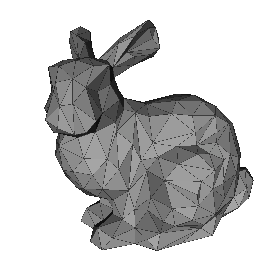
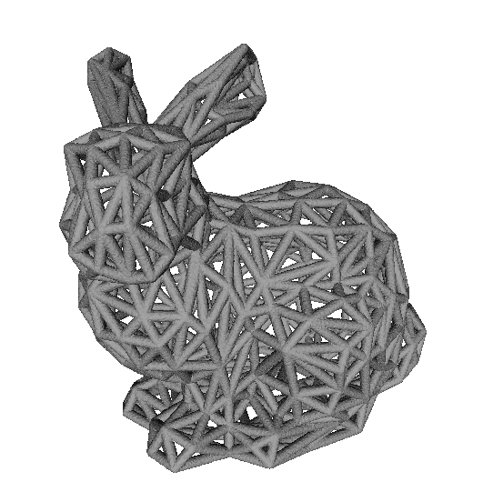
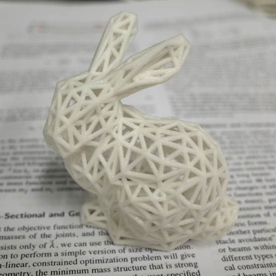

Mesh2Wire
=====================================================
This progrem converts polygon mesh to 3d printable wire model.

### Details
Input mesh should be off file format.
Output wire model is generated as off file.

### Requirement
1. [CGAL](http://www.cgal.org/)

### Sample

##### input
bunny model (courtesy of [the Stanford 3D Scanning Repository](http://graphics.stanford.edu/data/3Dscanrep/))

##### output

##### printed model

